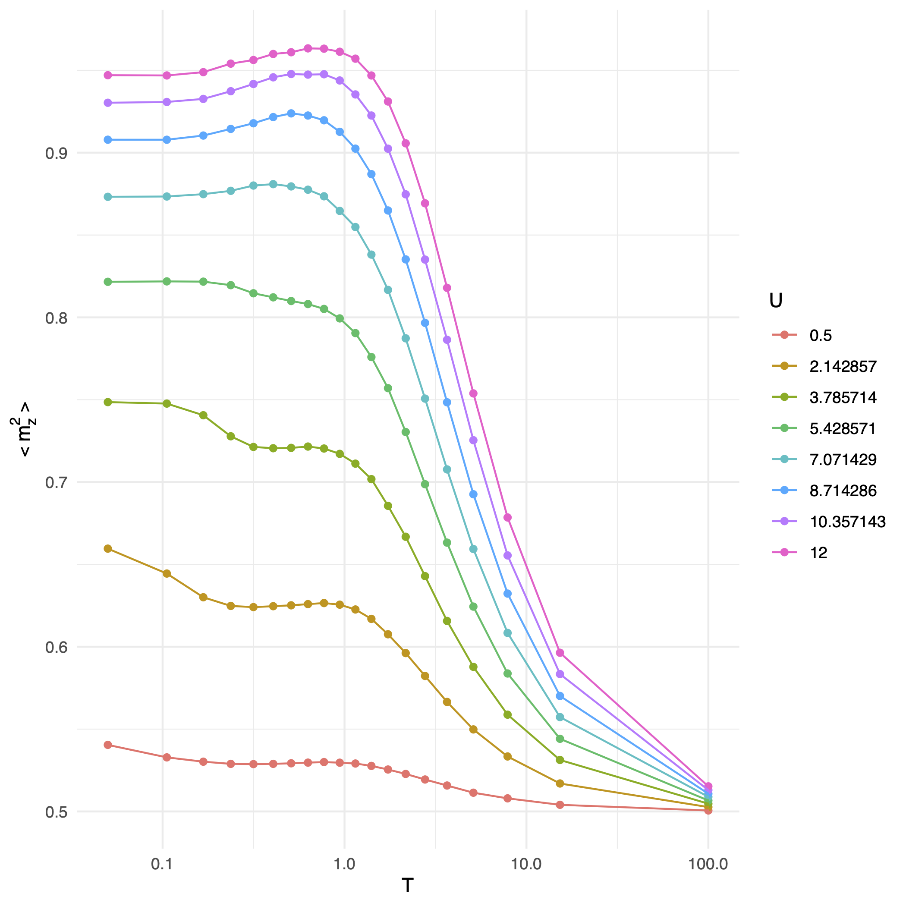

# dqmc-framework


**This is a fork of the original [dqmc-framework](https://github.com/JefferyWangSH/dqmc-framework) by JefferyWangSH.**

In this repository, we present a general C++ implementation of determinant Quantum Monte Carlo `(DQMC)` algorithm for the simulation of fermionic quantum models on various lattice geometries.

Currently, simulations of the fermionic Hubbard model with both attractive and repulsive interaction are supported. Lattices including 1d chains, 2d square and the 3d cubic lattice are available, with additional geometries planned.




---

## Installation ##

### Prerequisites ###

* A C++20-capable compiler such as `g++ >= 11` or `clang++ >= 14`, and `cmake >= 3.21`.
* `Boost` program options module `( version >= 1.83 )`.
* `Eigen` linear algebra library `( version >= 3.4.0 )`.
* A BLAS/LAPACKE implementation (e.g., `OpenBLAS`, `Intel MKL`, `Accelerate` on macOS) available at link time.

### Building ###

1. Configure the build with CMake:
   ```shell
   cmake -S . -B build -G Ninja -DBUILD_TESTING=ON
   ```

2. Build the project:
   ```shell
   cmake --build build
   ```

3. (Optional) Run the unit tests:
   ```shell
   ctest --test-dir build
   ```

### Usage ###

Run the simulation with default parameters:
```shell
./build/main
```

Inspect available command-line options:
```shell
./build/main --help
```

For detailed configuration options and examples, see [example/README.md](example/README.md).


## Features ##

1. **Core DQMC modules independent of specific models and lattices.** The well-designed DQMC sweeping process is tested stable and of high computational efficiency.
2. **Modularly designed and highly extensible.** To simulate other models on different lattices, one should simply write their own Model and Lattice class, which should be derived from corresponding base classes, and implement the virtual interfaces and methods in a correct way. 
3. Support equal-time and dynamical measurements of various physical observables, and **adding measurements of user-defined observables is straightforward.**
4. Support checkerboard break-ups with efficient linear algebra ( for bipartite lattices only ).


## References ##

1. H. Fehske, R. Schneider, A. Weiße, Computational Many-Particle Physics, *Springer*, 2008. [doi](https://doi.org/10.1007/978-3-540-74686-7)
2. James Gubernatis, Naoki Kawashima, Philipp Werner, Quantum Monte Carlo Methods: Algorithms for Lattice Models, *Cambridge University Press*, 2016. [doi](https://doi.org/10.1017/CBO9780511902581)
3. Xiao Yan Xu, *Tutorial*: Solving square lattice Hubbard Model with DQMC, 2016. [doi](http://ziyangmeng.iphy.ac.cn/files/teaching/SummerSchoolSimpleDQMCnoteXYX201608.pdf)
4. C. N. Varney, C. R. Lee, Z. J. Bai et al., Quantum Monte Carlo study of the two-dimensional fermion Hubbard model, *Phys. Rev. B 80, 075116*, 2009. [doi](https://doi.org/10.1103/PhysRevB.80.075116)
5. Thereza Paiva, Raimundo R. dos Santos, R. T. Scalettar et al., Critical temperature for the two-dimensional attractive Hubbard model, *Phys. Rev. B 69, 184501*, 2004. [doi](https://doi.org/10.1103/PhysRevB.69.184501)
6. Xiao Yan Xu, Kai Sun, Yoni Schattner et al., Non-Fermi Liquid at (2 + 1) D Ferromagnetic Quantum Critical Point, *Phys. Rev. X 7, 031058*. [doi](https://doi.org/10.1103/PhysRevX.7.031058)
7. Douglas J. Scalapino, Steven R. White, and Shoucheng Zhang, Insulator, metal, or superconductor: The criteria, *Phys. Rev. B 47, 7995.* [doi](https://doi.org/10.1103/PhysRevB.47.7995)
8. Ulli Wolff, Monte Carlo errors with less errors [ArXiv](https://arxiv.org/abs/hep-lat/0306017)


## License & Support ##

This code is an open-source software under the MIT license.

If any problems or bugs arise, please open an issue on GitHub or reach out to the dqmc-org maintainers.
